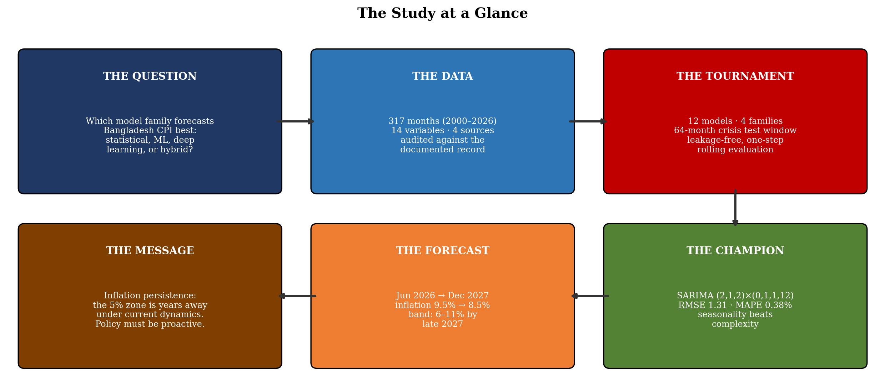
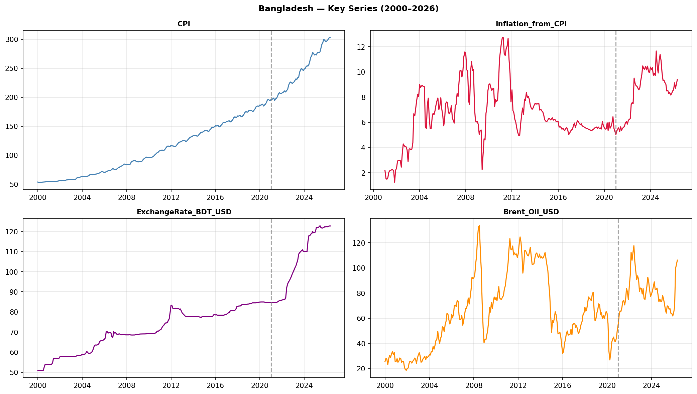
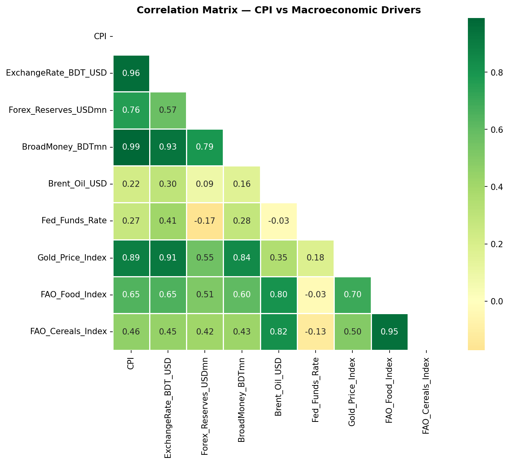
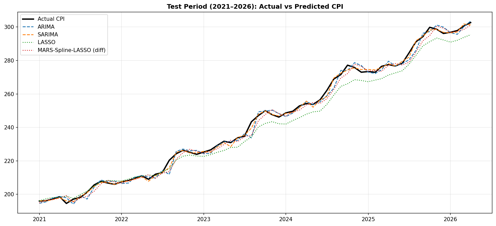
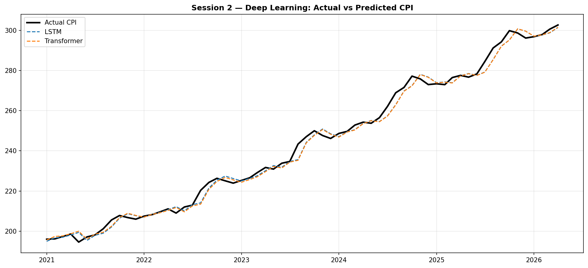
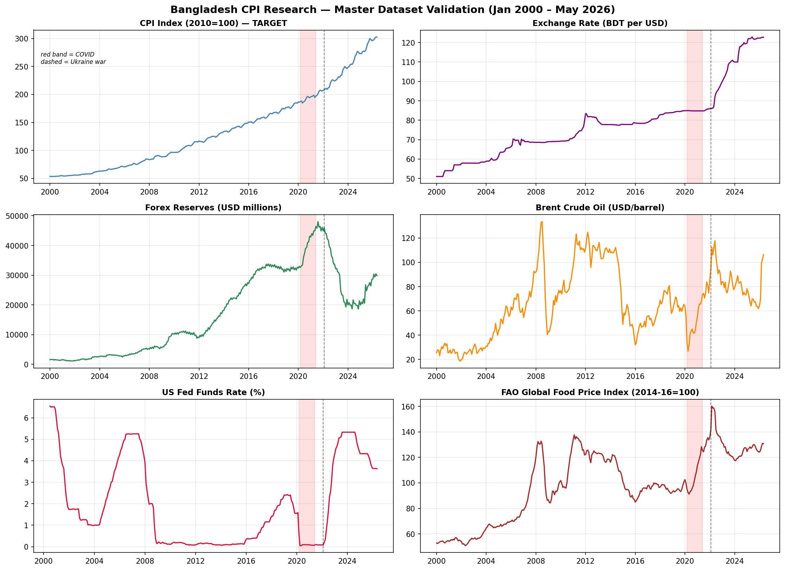
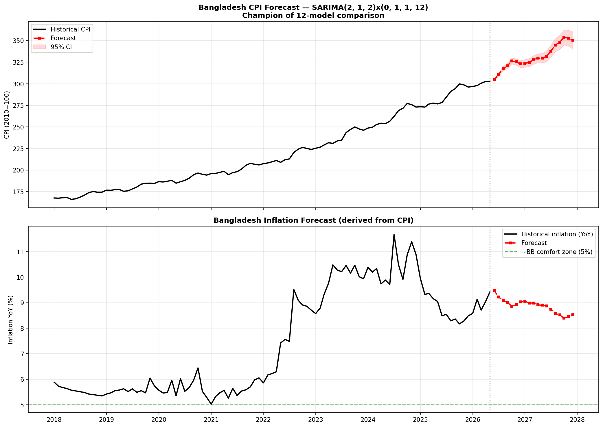

# Forecasting Consumer Price Index and Inflation in Bangladesh
### A Comparative Analysis of Statistical, Machine Learning, and Hybrid Approaches

[](https://opensource.org/licenses/MIT)
[](https://www.python.org/)
[](https://jupyter.org/)
[](https://colab.research.google.com/)

> **Author:** Imran Hasan Sohan  
> **Research Domain:** Econometrics · Time Series Forecasting · Macroeconomics  
> **Keywords:** CPI, Inflation, Bangladesh, SARIMA, LSTM, Transformer, Hybrid Models, Forecasting

---

## 📌 Overview

This repository contains the complete research codebase for a dissertation studying **Consumer Price Index (CPI) and inflation forecasting in Bangladesh** using a rigorous comparative framework across three model families:

- **Statistical Models** — ARIMA, SARIMA, LASSO, MARS-Spline
- **Deep Learning Models** — LSTM, Transformer
- **Hybrid Models** — ARIMA-LSTM, SARIMA-LSTM, SARIMA-HMM-LSTM, Wavelet-SARIMA-LSTM, VMD-LSTM

A total of **12 models** were evaluated on monthly Bangladesh CPI data spanning **January 2000 to April 2026**, with the test period covering **January 2021 to April 2026** — including the challenging 2022–2023 inflation crisis.

---

## 🏆 Key Results

| Model | R² | RMSE | MAE | MAPE |
|---|---|---|---|---|
| **SARIMA(2,1,2)×(0,1,1,12)** ⬅ Champion | **0.9985** | **1.3053** | **0.9370** | **0.384%** |
| SARIMA-LSTM | 0.9985 | 1.3106 | 0.9298 | 0.381% |
| SARIMA-HMM-LSTM | 0.9983 | 1.3984 | 0.9799 | 0.401% |
| Wavelet-SARIMA-LSTM | 0.9977 | 1.6227 | 1.2504 | 0.506% |
| ARIMA-LSTM | 0.9950 | 2.4047 | 1.8126 | 0.743% |
| ARIMA-HMM-LSTM | 0.9944 | 2.5321 | 1.8254 | 0.743% |
| ARIMA(3,2,3) | 0.9940 | 2.6239 | 1.9146 | 0.786% |
| VMD-LSTM | 0.9939 | 2.6349 | 2.0054 | 0.804% |
| LSTM | 0.9937 | 2.6889 | 2.0589 | 0.838% |
| Transformer | 0.9933 | 2.7714 | 2.1248 | 0.866% |
| MARS-Spline-LASSO | 0.9932 | 2.7923 | 2.1712 | 0.886% |
| LASSO | 0.9770 | 5.1332 | 4.3137 | 1.676% |

> **Key Finding:** The classical `SARIMA(2,1,2)×(0,1,1,12)` model emerged as the champion, outperforming all deep learning and hybrid alternatives on this dataset. SARIMA's strong seasonal structure effectively captures Bangladesh's monthly CPI patterns. Hybrid models (SARIMA-LSTM, SARIMA-HMM-LSTM) were competitive runners-up.

---

## 📈 Bangladesh CPI & Inflation Forecast (Jun 2026 – Dec 2027)

Produced by the champion SARIMA model refitted on the full available series (Jan 2000 – May 2026):

| Month | CPI Forecast | 95% CI | Inflation YoY |
|---|---|---|---|
| Jun 2026 | 304.64 | [303.12–306.16] | 9.47% |
| Jul 2026 | 310.74 | [308.61–312.87] | 9.23% |
| Aug 2026 | 317.64 | [315.02–320.25] | 9.08% |
| Sep 2026 | 320.78 | [317.74–323.81] | 9.01% |
| Oct 2026 | 326.40 | [323.00–329.81] | 8.86% |
| Nov 2026 | 325.30 | [321.55–329.06] | 8.92% |
| Dec 2026 | 322.89 | [318.82–326.97] | 9.03% |
| Jun 2027 | 331.68 | [325.42–337.94] | 8.88% |
| Dec 2027 | 350.47 | [340.69–360.25] | 8.54% |

> Inflation is projected to remain elevated (~8.5–9.5% YoY) through 2027, well above Bangladesh Bank's comfort zone (~5%).

---

## 📊 Figures

| Figure | Description |
|---|---|
|  | Bangladesh key macro series overview (2000–2026) |
|  | EDA: CPI, Inflation, Exchange Rate, Oil Price |
|  | Correlation matrix — CPI vs macroeconomic drivers |
|  | Statistical models: Actual vs Predicted CPI |
|  | Deep learning models: Actual vs Predicted CPI |
|  | Master dataset validation |
|  | **Final forecast: Bangladesh CPI & Inflation (2026–2027)** |

---

## 📁 Repository Structure

```
bangladesh-cpi-inflation-forecasting/
│
├── README.md                               # This file
├── LICENSE                                 # MIT License
├── .gitignore
│
├── notebooks/
│   ├── 01_statistical_models.ipynb         # Session 1: ARIMA, SARIMA, LASSO, MARS
│   ├── 02_deep_learning_models.ipynb       # Session 2: LSTM, Transformer
│   └── 03_hybrid_models_and_forecast.ipynb # Session 3: Hybrid models + final forecast
│
├── data/
│   ├── README.md                           # Data sources & download instructions
│   ├── raw/
│   │   ├── DFF.csv                         # US Federal Funds Rate (FRED)
│   │   ├── POILBREUSDM.csv                 # Brent Crude Oil Price (FRED)
│   │   ├── IQ12260.csv                     # Exchange rate data (IMF)
│   │   ├── food_price_indices_data.csv     # FAO Food Price Indices
│   │   └── time_series_data1972-2024.xlsx  # Bangladesh historical time series
│   └── processed/
│       ├── bangladesh_cpi_monthly_RESEARCH_READY.csv  # Clean monthly CPI
│       └── bangladesh_combined_dataset.csv            # Master dataset (all variables)
│
└── figures/
    ├── fig_1_1_overview.png
    ├── fig_eda_series.png
    ├── fig_correlation.png
    ├── fig_session1_predictions.png
    ├── fig_session2_predictions.png
    ├── master_dataset_validation.png
    └── FINAL_forecast_chart.png
```

> **Note:** Large raw IMF datasets (~90MB–333MB) are **not included** in this repository due to GitHub file size limits. See [`data/README.md`](data/README.md) for download instructions.

---

## 🗂️ Notebooks

### Session 1 — Statistical Models [`01_statistical_models.ipynb`](notebooks/01_statistical_models.ipynb)
- Data loading and master dataset construction from IMF/FRED/FAO sources
- Exploratory Data Analysis (EDA) and correlation analysis
- Auto-ARIMA grid search → best order: `ARIMA(3,2,3)`
- Seasonal ARIMA grid search → best order: `SARIMA(2,1,2)×(0,1,1,12)`
- LASSO regression with macroeconomic exogenous variables
- MARS (Multivariate Adaptive Regression Spline) + LASSO on first differences
- Train window: Jan 2000 – Dec 2020 | Test: Jan 2021 – Apr 2026

### Session 2 — Deep Learning Models [`02_deep_learning_models.ipynb`](notebooks/02_deep_learning_models.ipynb)
- Sequence-to-point LSTM with 12-month lookback window
- Transformer with multi-head attention (4 heads) + positional encoding
- 12 macroeconomic features as input channels
- StandardScaler fit on train-only to prevent data leakage
- Early stopping (patience=25) on validation loss

### Session 3 — Hybrid Models & Final Forecast [`03_hybrid_models_and_forecast.ipynb`](notebooks/03_hybrid_models_and_forecast.ipynb)
- **ARIMA-LSTM / SARIMA-LSTM:** Stat model for trend + LSTM for residuals
- **ARIMA-HMM-LSTM / SARIMA-HMM-LSTM:** Adds Hidden Markov Model for regime detection
- **Wavelet-SARIMA-LSTM:** Causal rolling wavelet decomposition (db4, level 2) + SARIMA on smooth + LSTM on detail
- **VMD-LSTM:** Variational Mode Decomposition (K=4 modes, causal rolling) + LSTM
- Final scoreboard comparison of all 12 models
- Final SARIMA forecast: Jun 2026 → Dec 2027

---

## 🚀 Getting Started

### Prerequisites
```
Python 3.10+
TensorFlow 2.x
statsmodels
scikit-learn
pandas, numpy, matplotlib, seaborn
hmmlearn
PyWavelets
vmdpy
```

### Option 1: Run on Google Colab (Recommended)
All notebooks are designed for **Google Colab** with GPU support (T4 recommended for Sessions 2 & 3).

1. Upload your data files to Google Drive under `MyDrive/CPI_Research/`
2. Open the notebooks in Colab
3. Mount Google Drive when prompted
4. Run cells in order

### Option 2: Run Locally
```bash
git clone https://github.com/sohanever/bangladesh-cpi-inflation-forecasting.git
cd bangladesh-cpi-inflation-forecasting
pip install -r requirements.txt
jupyter notebook
```

> ⚠️ **Note:** Sessions 2 & 3 use TensorFlow and may be slow without a GPU. Adjust `SEED`, `epochs`, and `batch_size` as needed.

---

## 📐 Methodology

```
Jan 2000 ──────────────── Dec 2020 ║ Jan 2021 ──────────── Apr 2026
         TRAINING WINDOW           ║        TEST WINDOW
         (252 months)              ║        (64 months)
                                   ║
                                   ▼
                         Covers 2022–23 inflation crisis ✅
```

**No data leakage policy:**
- All scalers (StandardScaler) fitted on training data only
- Rolling/causal decompositions (VMD, Wavelet) use only past data at each step
- HMM fitted on training residuals only
- SARIMA rolling forecast: one-step-ahead on test set

---

## 📦 Variables in Master Dataset

| Variable | Description | Source |
|---|---|---|
| `CPI` | Bangladesh Consumer Price Index (2010=100) | IMF IFS / BBS |
| `Inflation_from_CPI` | Year-on-year % change in CPI | Derived |
| `ExchangeRate_BDT_USD` | BDT per USD exchange rate | IMF |
| `Forex_Reserves_USDmn` | Bangladesh foreign exchange reserves (USD mn) | IMF |
| `BroadMoney_BDTmn` | M2 broad money supply (BDT mn) | IMF MFS |
| `Brent_Oil_USD` | Brent crude oil price (USD/barrel) | FRED |
| `Fed_Funds_Rate` | US Federal Funds Rate (%) | FRED |
| `Gold_Price_Index` | Gold price index | IMF IFS |
| `FAO_Food_Index` | FAO Food Price Index | FAO |
| `FAO_Cereals_Index` | FAO Cereals Price Index | FAO |
| `COVID_dummy` | Binary: 1 for Mar 2020–Dec 2021 | Engineered |
| `UkraineWar_dummy` | Binary: 1 for Mar 2022–Dec 2023 | Engineered |
| `BD_Unrest_dummy` | Binary: 1 for civil unrest period | Engineered |

---

## 📜 Citation

If you use this code or data in your research, please cite:

```bibtex
@misc{sohan2026bangladesh,
  author       = {Imran Hasan Sohan},
  title        = {Forecasting Consumer Price Index and Inflation in Bangladesh:
                  A Comparative Analysis of Statistical, Machine Learning,
                  and Hybrid Approaches},
  year         = {2026},
  publisher    = {GitHub},
  journal      = {GitHub repository},
  howpublished = {\url{https://github.com/sohanever/bangladesh-cpi-inflation-forecasting}}
}
```

---

## 📬 Contact

**Imran Hasan Sohan**  
📧 imran173461@gmail.com  
🔗 [GitHub: @sohanever](https://github.com/sohanever)

> *Physics undergrad | Aspiring Quantum Scientist | Data Analyst*  
> *Building at the intersection of AI & Quantum Computing*

---

## 📄 License

This project is licensed under the **MIT License** — see the [LICENSE](LICENSE) file for details.

The data files are subject to their respective original data provider terms.  
See [`data/README.md`](data/README.md) for full attribution.
